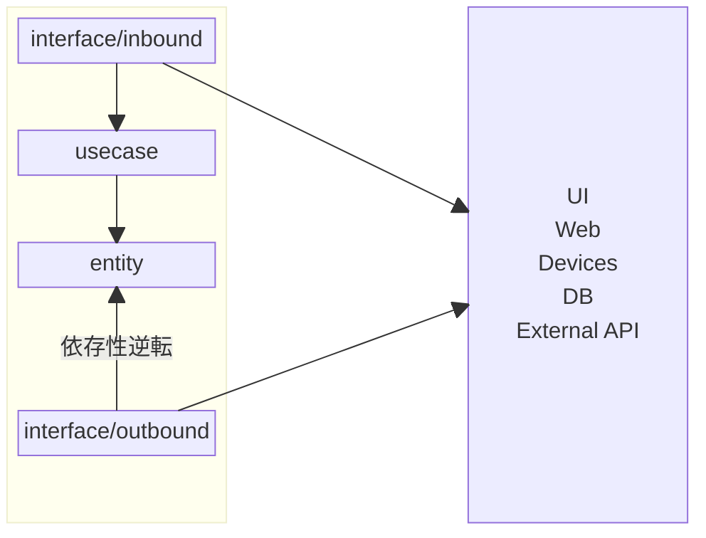

# アーキテクチャ

## 概要

[The Clean Architecture](https://blog.cleancoder.com/uncle-bob/2012/08/13/the-clean-architecture.html)をベースに設計

## entity

エンティティとそれに紐づくビジネスルールをカプセル化する。
DB や外部 API の操作が必要なメソッドは interface のみ定義し、依存性逆転を行う。

usecase を見れば全体の処理の流れを追える状態にするため、極力複数のエンティティに跨るドメインサービスは使用しない。

## usecase

entity を使用して実際の一連の処理を記述する。

## interface

### inbound

外部からのリクエストを受け取り、usecase を呼び出し、結果に応じてレスポンスを返す。

### outbound

entity 層で定義した interface の実装を行う。DB や外部 API などとのやり取りを実装する。

## 各レイヤーの依存方向

entity, usecase が API の通信形式や DB などに依存しないようにする。

